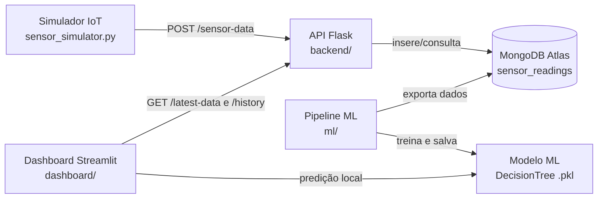

# 🚀 SpaceFarm AI


Plataforma de **agricultura preditiva** que combina sensores IoT, dados espaciais (NDVI) e
Machine Learning para recomendar irrigação e monitorar a saúde da lavoura em tempo real.

Projeto desenvolvido para a **Global Solution FIAP 2026**.

---

## 🏗 Arquitetura



**Fluxo de dados:**

1. O **simulador IoT** gera leituras (temperatura, umidade do ar, umidade do solo, luminosidade e NDVI) e envia para a API.
2. A **API Flask** valida cada leitura e persiste no **MongoDB Atlas**.
3. O **pipeline de ML** exporta as leituras, gera a variável-alvo (risco hídrico → irrigar) e treina um modelo de classificação.
4. O **dashboard Streamlit** consome a API, exibe métricas em tempo real e usa o modelo treinado para recomendar (ou não) irrigação.

## 📁 Estrutura do Projeto

```
spacefarm-ai/
├── backend/              # API Flask
│   ├── app.py            # Aplicação, CORS, logging e error handlers
│   ├── routes.py         # Rotas + validação das leituras
│   └── services/         # Regras de persistência
├── dashboard/            # Dashboard Streamlit
│   ├── app.py            # Interface com métricas, IA e gráficos
│   └── services/         # Cliente HTTP da API
├── database/             # Conexão com MongoDB Atlas (via .env)
├── ml/                   # Pipeline de Machine Learning
│   ├── export_data.py    # Exporta leituras do Mongo para CSV
│   ├── create_target.py  # Gera a variável-alvo (irrigar)
│   ├── train_model.py    # Treina e salva o modelo
│   ├── compare_models.py # Decision Tree vs Random Forest
│   └── predict_service.py# Serviço de predição usado pelo dashboard
├── data/                 # Geração de dataset sintético
├── tests/                # Testes automatizados (pytest)
├── sensor_simulator.py   # Simulador de sensores IoT
├── Dockerfile
├── docker-compose.yml
└── requirements.txt
```

## ⚙️ Como Executar

### Pré-requisitos

- Python 3.12+
- Conta no [MongoDB Atlas](https://www.mongodb.com/atlas) (ou MongoDB local)

### 1. Configurar variáveis de ambiente

```bash
cp .env.example .env
# edite o .env e preencha o MONGO_URI com as suas credenciais
```

### 2. Instalar dependências

```bash
python -m venv venv
source venv/bin/activate        # Linux/Mac
# venv\Scripts\activate         # Windows

pip install -r requirements.txt
```

### 3. Subir a API

```bash
python -m backend.app
```

A API fica disponível em `http://localhost:5000`.

### 4. Iniciar o simulador de sensores (outro terminal)

```bash
python sensor_simulator.py
```

### 5. Abrir o dashboard (outro terminal)

```bash
streamlit run dashboard/app.py
```

O dashboard abre em `http://localhost:8501` e atualiza sozinho a cada 15 segundos.

### 🐳 Alternativa: Docker Compose

Com Docker instalado, basta:

```bash
cp .env.example .env   # preencher MONGO_URI
docker compose up --build
```

Sobe API (`:5000`), dashboard (`:8501`) e simulador de uma vez.

## 🔌 Rotas da API

| Método | Rota           | Descrição                                      |
|--------|----------------|------------------------------------------------|
| GET    | `/health`      | Healthcheck da API                             |
| POST   | `/sensor-data` | Recebe uma leitura de sensores (JSON validado) |
| GET    | `/latest-data` | Última leitura registrada                      |
| GET    | `/history`     | Últimas 100 leituras                           |

Exemplo de payload do `POST /sensor-data`:

```json
{
  "temperatura": 30,
  "umidade_ar": 60,
  "umidade_solo": 25,
  "luminosidade": 800,
  "ndvi": 0.45
}
```

## 🤖 Machine Learning

- **Problema:** classificação binária — irrigar (`1`) ou não irrigar (`0`).
- **Features:** temperatura, umidade do ar, umidade do solo, luminosidade e NDVI.
- **Variável-alvo:** derivada de um índice de risco hídrico calculado em `ml/create_target.py`.
- **Modelo:** Decision Tree (comparado com Random Forest em `ml/compare_models.py`).

Pipeline completo:

```bash
python ml/export_data.py      # Mongo -> CSV
python ml/create_target.py    # gera variável-alvo
python ml/train_model.py      # treina e salva o .pkl
python ml/compare_models.py   # compara métricas dos modelos
```

## ✅ Testes

```bash
pip install pytest mongomock
pytest tests/ -v
```

Os testes cobrem a validação da API, as rotas (com banco em memória via `mongomock`)
e o serviço de predição do modelo. Eles também rodam automaticamente no GitHub Actions a cada push.

## 🔒 Segurança

- Credenciais do banco ficam **fora do código**, no arquivo `.env` (ignorado pelo git).
- Use o `.env.example` como modelo para configurar o ambiente.

## 👥 Equipe

| Nome                      | RM       |
|---------------------------|----------|
| Richard Wrobel dos Santos | RM573998 |
| Douglas Felicio da Silva  | RM572312 |
| Matheus Fontes            | RM570457 |

## 🛠 Tecnologias

- Python · Flask · Gunicorn
- MongoDB Atlas (PyMongo)
- Pandas · Scikit-Learn · Joblib
- Streamlit · Plotly
- Docker · GitHub Actions · Pytest
